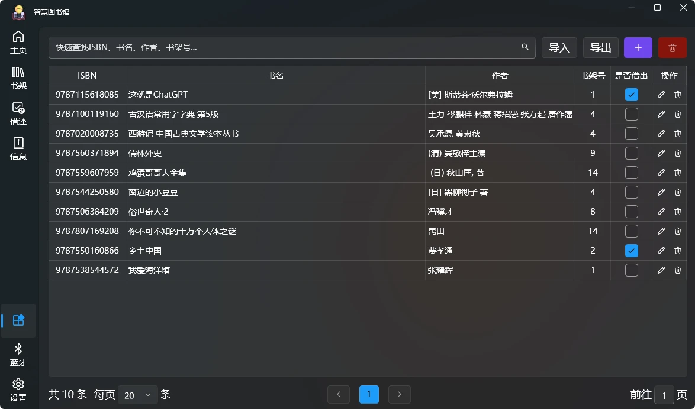
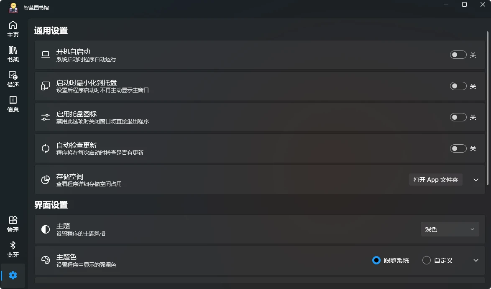

  

<h1 align="center">Smart Library</h1>

一个基于WPF和Arduino的智慧图书管理系统

## 简介
随着我国文化教育事业的飞速发展，图书馆藏书量不断增多，仅依靠人工操作已经不能高效地提供阅读服务。我们通过调研走访昆明市多家图书馆，了解到图书馆普遍存在书籍种类繁多、找书难；借阅书籍的流程繁琐，借书难；大量书籍需要清点，工作量大且效率低，归位难；现有图书馆管理系统功能单一，以机器人技术为基础，减少繁琐、重复手工操作的自动化管理流程有很大改进空间等问题。为解决这些问题，我们构思了一款采用基于 Arduino，综合应用 RFID 模块、蓝牙模块和条形码扫码等模块来实现位置引导、找书、借书、还书等功能的图书馆查、借、还智慧一体机器人。

## 研究内容和难点
我们课题小组研究的内容为：借助Arduino机器人的无线射频识别系统（RFID）和条形码扫描模块，通过扫描图书实现信息采集，实现书名或者作者等关键信息搜索，同步展示出图书相关信息，读者可以快速找到书籍和书籍相关信息（如：价格、库存、类别和存放位置等）。采用多传感器组合的机器人将实现引导、找书、借书、还书等功能。
当前研究的难点主要集中在几个方面：
1、机器人由于每一个要实现的功能都需要不同模块堆叠，随着部件的增加，工作量和设计难度也大大提高，本次课题只能围绕基础功能需求展开，在一期成果上再展开再次研究和开发。
2、课题研究所采用Arduino打造图书馆智慧机器人系统是需要打通图书馆原有管理系统，实现数据动态共享、查询、分析、回传等功能还是有一定难度。
3、智慧机器人系统基于Arduino平台，系统功率低，持续工作能力不高，可通过成果转化后实现。

## 研究目标
基于Arduino底层系统的开放性和扩展性，我们所设计的图书馆智慧机器人保有高扩展性，本课题研究基础上后续可以持续实现功能扩展及升级满足管理需求变化。
我们的设计目标是图书馆采用图书馆智慧机器人后，实现图书管理智慧化，用机器人代替人工，实现图书分拣、搬运、查重、贴码、上下架等日常操作，简化找书、借书、还书的环节，将人员从繁重传统操作中解放出来，为读者提供更加优质、便捷的图书阅读服务。

## 功能介绍
我们采用 .Net8和 WPF 框架设计了智慧图书馆软件，用户可在软件上快速浏览或查找图书馆所有藏书详细信息，包括所在书架号、借阅状态、出版信息等。如要找书，通过软件，小车可直接引导顾客到达图书对应书架，缩短在书海中徘徊寻找时间。同时，借书、还书功能仅需通过扫描图书条形码即可完成。还书后，小车可自动将书送到对应书架前的收集框中，管理员仅需将框中的书放入书架即可。同时，该软件还具备图书管理功能，图书管理员可通过程序向本地数据库进行增、删、查、改等操作，界面美观，操作简单；以及添加图书时，可通过书籍 ISBN 号，进行图书数据联网查询，免去了大量图书信息手动录入的时间。
另外，我们还使用 C++语言编写了小车的 Arduino 主控板控制程序，通过红外巡线模块使小车按照指定路线前进；通过 PID 算法控制小车电机，使小车能够平稳前行和转弯；采用 RFID 识别技术，判断是否到达指定书架，并通过蓝牙通信与电脑交换数据，自主设计了通信数据结构，达到控制小车执行多种任务的目的，实现小车与电脑协同工作。

## 🧩 截图

主界面

书架界面

管理界面

设置界面

## 🌏 路线
- 改用 AI 视觉模块巡线
- 使用 AI 视觉模块直接识别书名信息
- 改进图书推出小车的方式，减少对书籍的损害，并实现多本图书一同送回
- 增加用户管理系统
- 增加 AI 个性化推荐

## ⌨️ 开发环境
[Visual Studio 2022](https://visualstudio.microsoft.com/zh-hans/vs)

- 系统要求
     - [Windows 11 版本 21H2 或更高版本：家庭版、专业版、专业教育版、专业工作站版、企业版和教育版](https://learn.microsoft.com/zh-cn/visualstudio/releases/2022/system-requirements)

- 工作负荷
     - .NET 桌面开发

- 插件
     -  [XAML Styler for Visual Studio 2022(可选)](https://marketplace.visualstudio.com/items?itemName=TeamXavalon.XAMLStyler2022)

## 引用
-   [🔗WPF UI](https://github.com/lepoco/wpfui)
-   [🔗32feet.NET](https://github.com/inthehand/32feet)
-   [🔗.NET Community Toolkit](https://github.com/CommunityToolkit/dotnet)

## 图标
<a href="https://www.flaticon.com/free-icons/reading" title="reading icons">Reading icons created by Freepik - Flaticon</a>

<a href="https://www.flaticon.com/free-icons/refresh-data" title="refresh data icons">Refresh data icons created by Freepik - Flaticon</a>

<a href="https://www.flaticon.com/free-icons/borrow" title="borrow icons">Borrow icons created by max.icons - Flaticon</a>

<a href="https://www.flaticon.com/free-icons/database" title="database icons">Database icons created by Freepik - Flaticon</a>

<a href="https://www.flaticon.com/free-icons/warning" title="warning icons">Warning icons created by Freepik - Flaticon</a>

## License
SmartLibrary is licensed under [GPLv3](./LICENSE).
Copyright © 2024 by Zhao Yanglei.