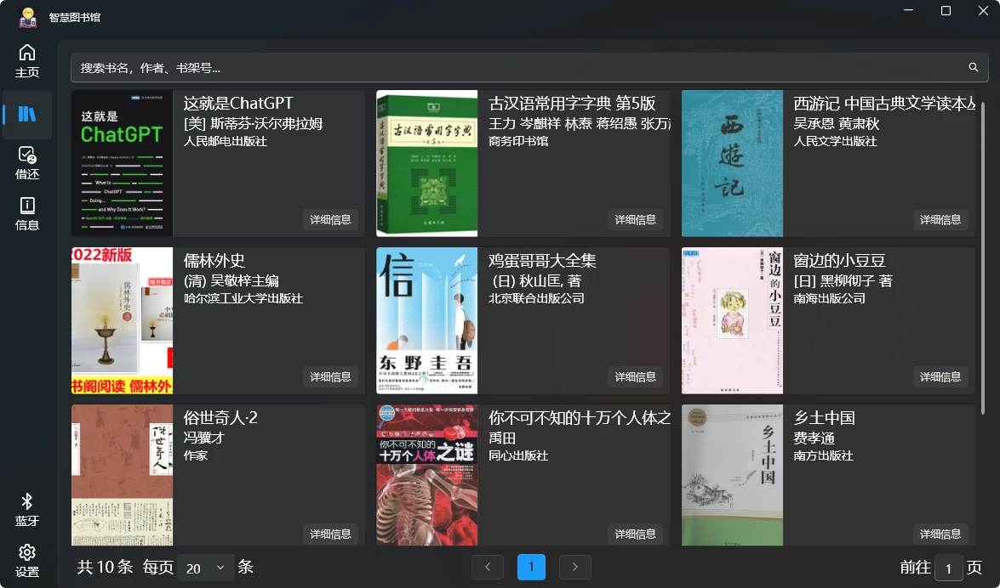

  

<h1 align="center">
  Smart Library
</h1>

  一个基于Qt6和Arduino的智慧图书管理系统

## 简介

随着小型化智能机器人技术的普及和应用环境的成熟，我们课题研究的目的是将图书馆日常管理工作和机器人自动图书信息采集、分类、查询、定位、导航、取放等纳入研究课题，以期研究一套经济、高效的智慧管理机器人。本课题在分析图书馆现行人工操作流程可替代实现的基础上，基于Arduino机器人应用技术和计算机编程，系统化设计课题第一期「图书馆智慧机器人」的功能、模型，并配套研发了图书馆日常管理工作实现机器人管理的「智慧图书管理系统」。
通过「图书馆智慧机器人」课题的研究成果落地应用和后续推进，以期将图书馆的管理和日常工作实现智慧化管理，繁杂重复的工作交由机器人来完成，人员更多的精力转向图书筛选、品质把控、图书推荐等提升阅读体验的工作中，使图书馆更具魅力吸引更多读者走进图书馆。

## 研究内容和难点
我们课题小组研究的内容为：借助Arduino机器人的无线射频识别系统（RFID）和条形码扫描模块，通过扫描图书实现信息采集，实现书名或者作者等关键信息搜索，同步展示出图书相关信息，读者可以快速找到书籍和书籍相关信息（如：价格、库存、类别和存放位置等）。采用多传感器组合的机器人将实现引导、找书、借书、还书等功能。
当前研究的难点主要集中在几个方面：
1、机器人由于每一个要实现的功能都需要不同模块堆叠，随着部件的增加，工作量和设计难度也大大提高，本次课题只能围绕基础功能需求展开，在一期成果上再展开再次研究和开发。
2、课题研究所采用Arduino打造图书馆智慧机器人系统是需要打通图书馆原有管理系统，实现数据动态共享、查询、分析、回传等功能还是有一定难度。
3、智慧机器人系统基于Arduino平台，系统功率低，持续工作能力不高，可通过成果转化后实现。

## 研究目标
基于Arduino底层系统的开放性和扩展性，我们所设计的图书馆智慧机器人保有高扩展性，本课题研究基础上后续可以持续实现功能扩展及升级满足管理需求变化。
我们的设计目标是图书馆采用图书馆智慧机器人后，实现图书管理智慧化，用机器人代替人工，实现图书分拣、搬运、查重、贴码、上下架等日常操作，简化找书、借书、还书的环节，将人员从繁重传统操作中解放出来，为读者提供更加优质、便捷的图书阅读服务。

## 🧩 截图

 

## 引用
-   [🔗WPF UI](https://github.com/lepoco/wpfui)
-   [🔗32feet.NET](https://github.com/inthehand/32feet)
-   [🔗.NET Community Toolkit](https://github.com/CommunityToolkit/dotnet)

## 图标
<a href="https://www.flaticon.com/free-icons/reading" title="reading icons">Reading icons created by Freepik - Flaticon</a>
<a href="https://www.flaticon.com/free-icons/refresh-data" title="refresh data icons">Refresh data icons created by Freepik - Flaticon</a>
<a href="https://www.flaticon.com/free-icons/borrow" title="borrow icons">Borrow icons created by max.icons - Flaticon</a>

## License
SmartLibrary is licensed under [GPLv3](./LICENSE).
Copyright © 2024 by Zhao Yanglei.